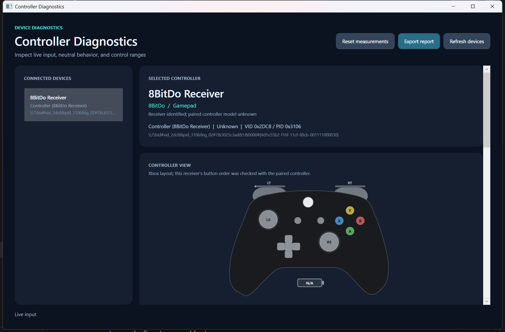
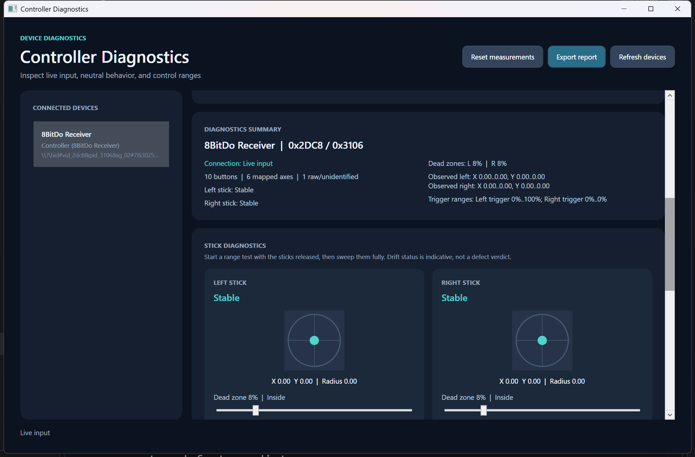
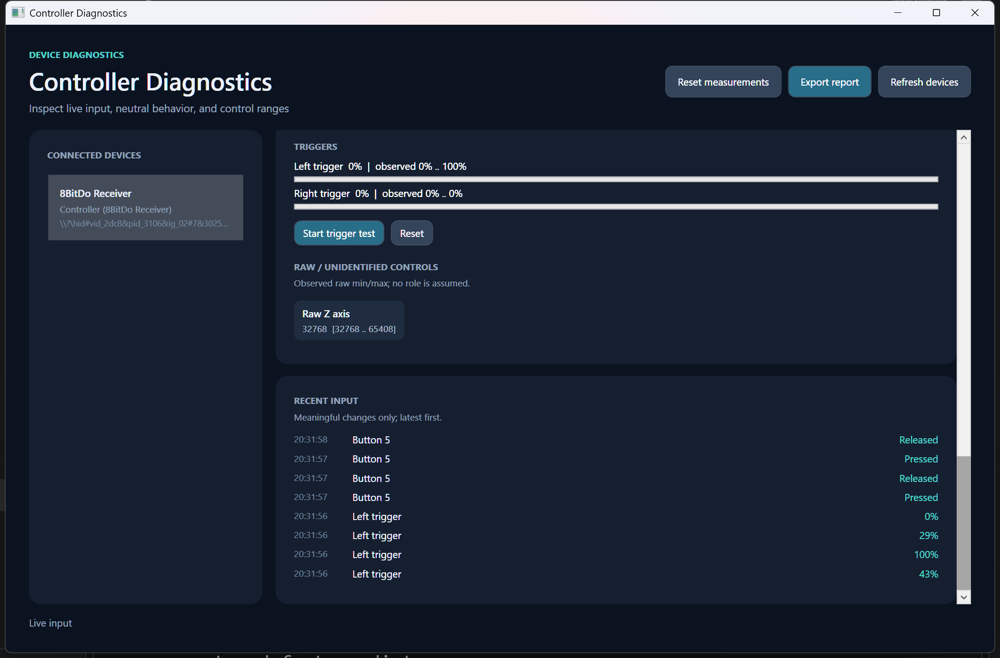

# Controller Diagnostics Tool

A Windows desktop utility for inspecting HID game controllers. It shows live controls, stick behavior, observed ranges, and a concise diagnostics report without changing controller or Windows settings.



## Features

- Discover connected USB and Bluetooth HID gamepads, select a device, and refresh the list. A selected device can recover after a disconnect and reconnect on the same HID path.
- View live buttons on an Xbox-style controller diagram, D-pad/hat switch, moving stick heads with click feedback, LT/RT levels, available HID battery percentage, and raw or unidentified controls. The connected 8BitDo receiver HID button order was checked against an Xbox-style A/B/X/Y controller.
- Inspect each stick's current position, resting center, observed range, and neutral deviation. The **Stable**, **Minor drift observed**, and **Noticeable drift observed** labels use a short steady sample window; they are indicators, not a defect verdict.
- Adjust a visual dead-zone radius for each stick and see whether its current position is inside or outside it. This does not alter controller firmware or Windows settings.
- Run and reset manual stick range tests. Trigger range tests are available when analog triggers can be identified. Raw controls retain observed minimum and maximum values.
- Review a short, filtered history of meaningful input changes. **Reset measurements** clears diagnostics for the selected device.
- Export a plain-text report with device identification, controls, drift and range results, dead zones, recent events, and limitations.





## Controller recognition and HID support

**Recognized in software:** Xbox-compatible controllers, PlayStation DualShock and DualSense, Nintendo Switch Pro Controller and Joy-Con, the 8BitDo receiver, and generic HID gamepads. Recognition uses known vendor/product IDs when available, then product text and vendor clues. The app labels uncertain matches as estimates.

**Physically tested:** the available 8BitDo receiver in gamepad mode (VID `2DC8`, PID `3106`). The receiver can be identified, but it does not reliably reveal the exact paired controller model. Other families have recognition support but were not physically validated for this release.

HID report layouts differ across devices. The app uses HID usages for practical mappings and leaves uncertain inputs visible as raw controls rather than assigning a stick or trigger role without evidence. Xbox-style button labels use the common HID button order for Xbox-family devices and the physically checked order for the 8BitDo receiver in its tested mode; other devices show numbered buttons on an illustrative layout. A physical controller may expose more than one HID interface; interfaces are shown separately when they cannot be grouped reliably.

## Run on Windows

Download `Controller-Diagnostics-Tool-v1.0.0-win-x64.zip` from the [v1.0.0 GitHub release](https://github.com/oric212/Controller-Diagnostics-Tool/releases/tag/v1.0.0), extract it, and run `Controller Diagnostics Tool.exe`. The Windows x64 package is self-contained, so a separate .NET installation is not required.

To build from source, install the .NET 8 SDK on Windows and run:

```powershell
dotnet build "Controller Diagnostics Tool.sln" -c Release
dotnet run --project "Controller Diagnostics Tool.csproj" -c Release
```

The application uses C# / .NET 8, WPF, and [HidSharp](https://github.com/IntergatedCircuits/HidSharp). Device access and input mapping live in `Services/`; diagnostic state and WPF presentation are kept separate.

## Current limitations

- Recognition is limited by the metadata and HID usages a device exposes. Generic or composite controllers may retain raw/unmapped controls.
- Stick and trigger mappings rely on common HID usages; manufacturer-specific reports may need a device-specific mapping.
- Battery percentage appears only when a device exposes the standard HID Battery Strength usage; the tested 8BitDo receiver did not provide it in observed input reports. The 8BitDo receiver does not reliably identify the paired physical controller. In the tested mode, LT and RT are opposite sides of one shared HID axis: each was verified separately, but simultaneous trigger pressure cannot be measured independently through this HID report.
- Drift results depend on resting samples and are diagnostic observations, not a hardware verdict. Manual range tests depend on how fully the user moves each control.
- Dead-zone controls are visualization only; they do not change controller output.
